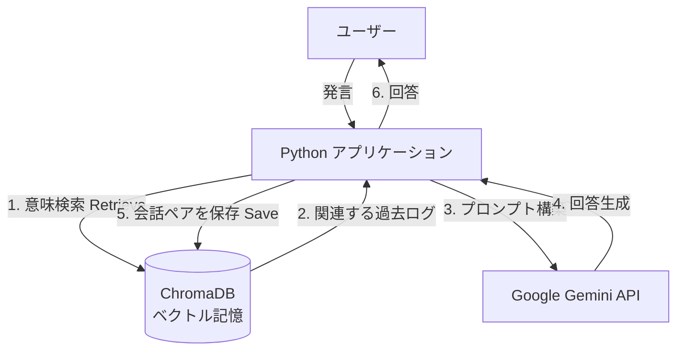

# 🧠 Gemini Memory Chatbot: RAG Architecture Demo

## 📖 概要 (Overview)

**「昨日の会話を覚えているAI」を実現する、RAG (Retrieval-Augmented Generation) ベースのチャットボットアプリケーションです。**

通常のLLM（大規模言語モデル）のチャットインターフェースは、セッションを閉じると記憶がリセットされてしまいます。本プロジェクトでは、**LangChain** と **ChromaDB（ベクトルデータベース）** を組み合わせることで、過去の会話内容を永続的に保存し、ユーザーの発言に関連する文脈を動的に引き出す「長期記憶」システムを実装しました。

モデルにはGoogleの最新鋭かつ高速な **Gemini 2.5 Flash** を採用し、リアルタイムで違和感のない会話体験を提供します。

## 🚀 技術的なハイライト (Technical Highlights)

採用担当者様へ：本プロジェクトでは以下の技術スタックとエンジニアリングスキルを実践しています。

* **RAG (検索拡張生成) の実装**:
* 単なる全履歴の送信ではなく、**Vector Search (ベクトル検索)** を用いて、現在の会話に関連性の高い記憶のみをピンポイントで抽出・注入する仕組みを構築。トークン数の節約と精度の向上を両立しています。


* **ベクトルデータベースの活用 (ChromaDB)**:
* テキストデータを **Google Generative AI Embeddings** を用いて高次元ベクトルに変換し、永続化しています。非構造化データのセマンティック検索（意味検索）の実装経験があります。


* **最新LLMのハンドリング**:
* `models/gemini-2.5-flash` を採用し、コストパフォーマンスと応答速度を最適化した設計を行っています。


* **LangChainによるオーケストレーション**:
* プロンプトテンプレートの管理、LLMとRetriever（検索機）のチェーン結合など、モダンなAIアプリ開発の標準フレームワークを活用しています。


## 🛠 アーキテクチャ (Architecture)



## 📦 機能 (Features)

1. **長期記憶の保持**: アプリを再起動しても、過去の会話内容（例：「私の好きな食べ物はカレー」など）を覚えています。
2. **文脈理解**: 「あれってどうなった？」のような指示語を含む質問に対し、過去のデータベースから適切な文脈を補完して回答します。
3. **ローカル永続化**: 会話データはローカル環境の `./chroma_memory_db` に安全に保存されます。

## 💻 セットアップと実行 (Setup & Usage)

### 前提条件

* Python 3.10以上
* Google AI StudioのAPIキー

### インストール

```bash
# リポジトリのクローン
git clone [repository-url]
cd [repository-name]

# 依存ライブラリのインストール
pip install langchain-google-genai langchain-chroma chromadb

```

### APIキーの設定

コード内の `os.environ["GOOGLE_API_KEY"]` 部分にAPIキーを設定するか、環境変数としてエクスポートしてください。

```python
# コード内設定例
import os
os.environ["GOOGLE_API_KEY"] = "your-api-key-here"

```

### 実行

```bash
python main.py

```

## 📝 実行例 (Demo)

**Session 1:**

> **User:** 初めまして。私はエンジニアを目指して勉強中の田中です。
> **AI:** 初めまして、田中さん！エンジニアを目指されているんですね。応援します！

*(アプリを再起動)*

**Session 2:**

> **User:** 私が誰だか覚えてる？
> **AI:** もちろんです。田中さんですね。エンジニアを目指して勉強中だと伺っています。進捗はいかがですか？

*(※ベクトル検索により、過去の自己紹介を記憶から呼び出して回答しています)*

## 🔮 今後の展望 (Future Improvements)

* **記憶の要約機能**: 古い記憶を圧縮・要約して保存し、ストレージ効率と検索精度を高める。
* **メタデータフィルタリング**: 「いつ」「どこで」話したか等のメタタグを付与し、時間軸を考慮した記憶検索の実装。
* **マルチモーダル対応**: 画像データなどもベクトル化し、視覚情報を含む記憶システムへの拡張。


